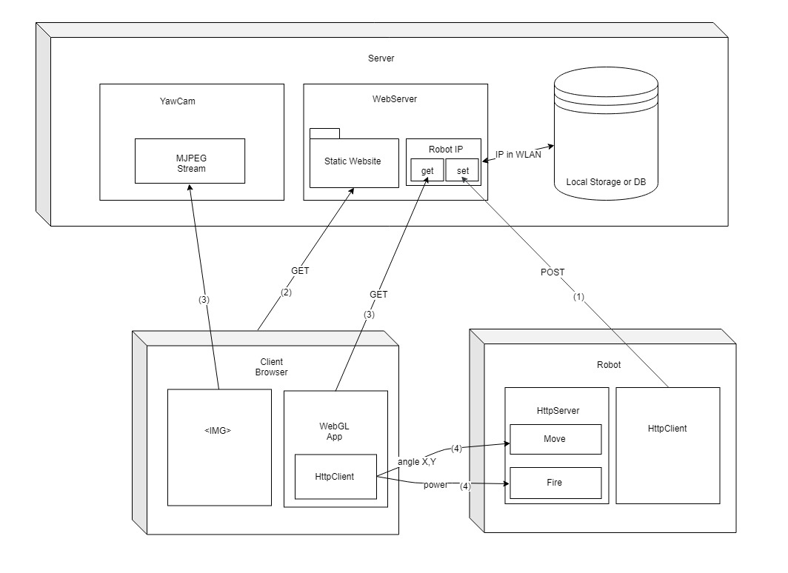
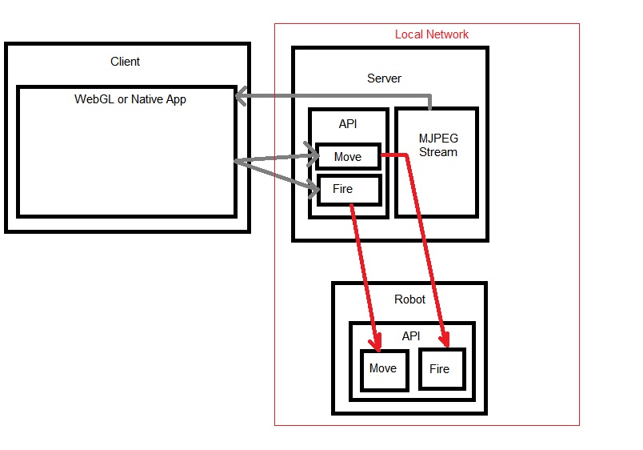

# BumbleBeer
This was a coding challange of mine that i presented as an IOT Project at Sofia University. 
It is in no way a complete Project, it is a quick experiment on controlling a Robot from a public WebSite and an Android app.  

The project implements a website that can control a physical beerpong robot that has 2 axis rotation, cup sensors and a coil gun. 
Watch it in operation on [YouTube](https://www.youtube.com/watch?v=oYCZETZMVRY "YouTube").   

## Contains
1. [Firmware](https://github.com/Fluctuationqt/BumbleBeer/blob/master/Firmware/StamatNodeMCU2/StamatNodeMCU2.ino)- The NodeMCU microcontroller code for the *Arduino IDE*.
2. [WebGLApp](https://github.com/Fluctuationqt/BumbleBeer/tree/master/WebGL%20App) - The right hand side of the control website. The full *Unity version 2017.1.1* Project.
3. [Control Website](https://github.com/Fluctuationqt/BumbleBeer/tree/master/Control%20Website/htdocs) - The Website for controling the robot. *PHP/JS/CSS/HTML*
4. [Schematics](https://github.com/Fluctuationqt/BumbleBeer/tree/master/Schematics) - Some of the schematics. *Will upload more on request!*

## Part List
* Microcontroller: NodeMCU 
* Servo: 10kg/cm (the pitch servo has been modified with an additional 2:1 gear reduction and an outboard potentiometer on the pitch axis because the mechanism can carry a 1kg DSLR with a telephoto lens if the barrel is removed.) 
 * The gun: A bank of capacitors at 660V that discharge into a coil that is arround the barrel. Inside the coil there is an elongated metal piton with a rebound spring that gets pushed when the caps discharge into the coil. This in term shoots the ping pong ball from the barrel at aprox 3m max distance and 10cm min distance depending on how much you charge the caps. The cap charging circuit (the white box) has a 2 relays that charge the caps from 220V AC through a diode and discharge them into the coil. The relays are connected to the NodeMCU via optocouplers for galvanic separation from the AC line.  
* The cup sensors are 3 pairs of an IR LED and an IR phototransistor that detect the reflection off of the ping pong balls when they go inside the cup. 
* The software: Apache/MySQL for the control website. It has a Unity WebGL app that sends out HTTP requests to the NodeMCU and visualizes the robot in 3D.  For the streaming i used a free software called YawCam it has an MJPEG streaming option and works flawlessly with low delay. The database holds a record of the robot's IP address in the Internal Network that gets set by the NodeMCU on startup. 

## Principle of Operation
### The system has 3 entities
The <b>Server</b> it hosts:
* WLAN to which the Robot connects
* MJPEG stream via YawCam and a connected USB WebCamera aimed at the Robot.
* WebServer

The <b>Robot</b> it implements:
* HttpClient - sends our current local ip obtained by the WLAN's DHCP upon connection.
* HttpServer - handles the movement and fire requests.
* Servo/Coil Gun/Cup Sensors - controllers for the servos and coil gun and cup sensors connected to the robot's microcontroller.

The <b>Client Browser</b>  
When a user opens the static website it views the MJPEG stream inside an  tag and it starts a Unity WebGL app that obtains the robot's IP address and sends out HTTP Requests for movement and fire directly to the robot. In a future update i will make an interface layer on the webserver that redirects the Movement and Fire requests of clients that are coming from outside the WLAN so that the robot is fully hidden inside the local network and all the control requests pass through the WebServer on port 80/443;
The use of a MySQL Databse is a complete overkill for storing a single record so i will move it to local storage on the Server.

Here is a diagram on how it currently works:

Robot and Server are in a WLAN that has open ports 80/443 directed to the Server.
0. Server Starts 
1. Robot Starts and connects to the Server's WLAN. When it obtains an IP by the DHCP server it sends the (1) HTTP Request that stores it's Local IP somewhere on the Server.
2. Client joins the WLAN (Client can have public access and you can skip this step if you add 2 endpoints on the WebServer that redirect the Move/Fire requests to the robot so that there are no direct requests going from the Client to the Robot) and opens the Control Website.
3. The image tag in the static page starts updating with the images from the MJPEG stream and the WebGL app requests the Robot IP (this is not necesarry if there are no direct requests sent out to the Robot)
4. Based on the user's input movement and fire requests are sent out directly to the Robot
 

 ## PS
* The WebGL app and stream can be reworked as a Unity Android app and the WebServer can be replaced with a native app that implements an HTTP Client/Server. Thus it would be easy to add a queue-ing mechanism for control.
This is how it should work:

* Contact [me](mailto:outrageousxqt@gmail.com "My Email") for more information. I'll be glad to help out.*
